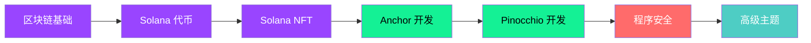

  
  <h1>🚀 Solana Zero to Hero</h1>
  <h3>从零开始，成为 Solana 开发高手</h3>
  
  
<strong>最全面的 Solana 中文学习资源 | 自学友好 | 实战驱动</strong>

  
<em>The Complete Chinese Guide to Solana Development</em>

  

    <a href="#-课程目录">📖 开始学习</a> •
    <a href="#-挑战列表">🎯 挑战练习</a> •
    <a href="#-社区">💬 加入社区</a> •
    <a href="./README_EN.md">🌐 English</a>
  

  

    
    
    
    
  

---

## ✨ 特色亮点

| 特色 | 描述 |
|------|------|
| 🇨🇳 **全中文内容** | 为中文开发者量身打造，无需翻译 |
| 📚 **21 门课程** | 覆盖 Solana 开发全栈技术 |
| 🎯 **15 个挑战** | 理论 + 实战相结合 |
| 🔧 **多框架覆盖** | Anchor、Pinocchio、Assembly 全覆盖 |
| 🔒 **安全专题** | 专门的程序安全课程 |
| 🔄 **持续更新** | 跟进 Solana 最新技术 |

---

## 🗺️ 学习路径

---

## 📚 课程目录

### 🌱 入门基础

| # | 课程 | 章节数 | 描述 |
|---|------|--------|------|
| 01 | [区块链与Solana入门](./courses/01-blockchain-and-solana) | 5 | 区块链基础、演进历程、Solana介绍 |
| 02 | [Solana代币](./courses/02-tokens-on-solana) | 5 | SPL代币机制、铸币账户、代币功能 |
| 03 | [Solana NFT](./courses/03-nfts-on-solana) | 4 | NFT基础、Metaplex标准 |

### ⚓ Anchor 开发

| # | 课程 | 章节数 | 描述 |
|---|------|--------|------|
| 04 | [Anchor开发教程](./courses/04-anchor-for-dummies) | 8 | Anchor基础、账户、指令、测试、部署 |
| 05 | [Anchor SPL代币](./courses/05-spl-token-with-anchor) | 9 | 使用Anchor开发SPL代币程序 |
| 13 | [Anchor Token2022](./courses/13-token-2022-with-anchor) | 13 | 使用Anchor开发Token2022程序 |

### 🎪 Pinocchio 开发

| # | 课程 | 章节数 | 描述 |
|---|------|--------|------|
| 06 | [Pinocchio开发教程](./courses/06-pinocchio-for-dummies) | 8 | Pinocchio框架入门、账户、指令、性能优化 |

### 🧪 测试工具

| # | 课程 | 章节数 | 描述 |
|---|------|--------|------|
| 07 | [Mollusk测试](./courses/07-testing-with-mollusk) | 3 | Mollusk测试框架入门与高级功能 |
| 08 | [Litesvm测试](./courses/08-testing-with-litesvm) | 4 | Litesvm测试工具，支持TypeScript和Rust |
| 09 | [Surfpool测试](./courses/09-testing-with-surfpool) | 3 | Surfpool测试框架 |

### 🔒 程序安全

| # | 课程 | 章节数 | 描述 |
|---|------|--------|------|
| 10 | [程序安全](./courses/10-program-security) | 11 | 常见安全漏洞与防护措施 |

### 🔮 高级主题

| # | 课程 | 章节数 | 描述 |
|---|------|--------|------|
| 11 | [Token2022程序](./courses/11-token-2022-program) | 3 | Token2022扩展功能介绍 |
| 12 | [Web3.js Token2022](./courses/12-token-2022-with-web3js) | 13 | 使用Web3.js操作Token2022 |
| 14 | [Web3.js SPL代币](./courses/14-spl-token-with-web3js) | 9 | 使用Web3.js操作SPL代币 |
| 15 | [Secp256r1签名](./courses/15-secp256r1-on-solana) | 4 | Secp256r1椭圆曲线签名 |
| 16 | [Winternitz签名](./courses/16-winternitz-signatures) | 4 | Winternitz一次性签名方案 |
| 17 | [Assembly汇编入门](./courses/17-introduction-to-assembly) | 6 | SBF汇编语言基础 |
| 18 | [指令内省](./courses/18-instruction-introspection) | 4 | 指令内省技术 |
| 19 | [Codama SDK](./courses/19-create-sdk-with-codama) | 5 | 使用Codama创建SDK |
| 20 | [Solana支付](./courses/20-solana-pay) | 4 | Solana Pay集成 |

---

## 🎯 挑战列表

### ⭐ Anchor 挑战 (入门)

| 挑战 | 描述 | 难度 |
|------|------|------|
| [Anchor金库](./challenges/01-anchor-vault) | 实现存款和取款功能 | ⭐ |
| [Anchor托管](./challenges/02-anchor-escrow) | 实现托管、接受、退款功能 | ⭐ |
| [Anchor闪电贷](./challenges/03-anchor-flash-loan) | 实现闪电贷功能 | ⭐ |
| [Anchor备忘录](./challenges/04-anchor-memo) | 实现链上备忘录 | ⭐ |

### ⭐⭐ Pinocchio 挑战 (进阶)

| 挑战 | 描述 | 难度 |
|------|------|------|
| [Pinocchio金库](./challenges/05-pinocchio-vault) | 使用Pinocchio实现金库 | ⭐⭐ |
| [Pinocchio托管](./challenges/06-pinocchio-escrow) | 使用Pinocchio实现托管 | ⭐⭐ |
| [Pinocchio闪电贷](./challenges/07-pinocchio-flash-loan) | 使用Pinocchio实现闪电贷 | ⭐⭐ |
| [Pinocchio备忘录](./challenges/08-pinocchio-memo) | 使用Pinocchio实现备忘录 | ⭐⭐ |
| [Pinocchio Secp256r1金库](./challenges/09-pinocchio-secp256r1-vault) | 使用Secp256r1签名的金库 | ⭐⭐ |
| [Pinocchio量子金库](./challenges/10-pinocchio-quantum-vault) | 量子安全的金库实现 | ⭐⭐ |

### ⭐⭐⭐ 高级挑战

| 挑战 | 描述 | 难度 |
|------|------|------|
| [Pinocchio AMM](./challenges/11-pinocchio-amm) | 实现自动做市商 | ⭐⭐⭐ |
| [Assembly备忘录](./challenges/12-assembly-memo) | 使用汇编实现备忘录 | ⭐⭐ |
| [Assembly超时](./challenges/13-assembly-timeout) | 实现超时检查 | ⭐⭐⭐ |
| [Assembly滑点](./challenges/14-assembly-slippage) | 实现滑点保护 | ⭐⭐⭐ |

### 🔧 TypeScript 挑战

| 挑战 | 描述 | 难度 |
|------|------|------|
| [TypeScript铸造SPL代币](./challenges/15-typescript-mint-spl-token) | 使用TypeScript铸造SPL代币 | ⭐ |

---

## 🚀 快速开始

### 前置要求

- **编程基础**：需要有基本的编程经验
- **Rust语言**：建议先学习 [Rust语言圣经](https://course.rs/about-book.html)
- **开发环境**：[Solana开发环境安装指南](https://solana.com/zh/docs/intro/installation)

### 学习建议

1. **循序渐进**：按照课程编号顺序学习，从基础到进阶
2. **理论+实践**：每学完一个课程，立即完成对应的挑战练习
3. **动手实践**：所有代码都要自己敲一遍，不要只看不做
4. **提交验证**：完成挑战后提交到 [Blueshift](https://learn.blueshift.gg/zh-CN) 进行验证

---

## 🔗 相关资源

### 官方资源

- 📖 [Solana官方文档](https://solana.com/zh/docs)
- 🎓 [Blueshift学习平台](https://learn.blueshift.gg/zh-CN)
- 💼 [Solana Job Board](https://jobs.solana.com/jobs)

### 开发工具

- 🛠️ [Solana Playground](https://beta.solpg.io/) - 在线开发环境
- ⚓ [Anchor](https://www.anchor-lang.com/) - Solana开发框架
- 📦 [本地节点安装](https://solana.com/zh/docs/intro/installation)

---

## 💬 社区

- 🐦 Twitter: [@Solana_zh](https://x.com/Solana_zh)
- 💬 Telegram: [solanaZH_official](https://t.me/solanaZH_official)
- 🌐 官网: [solar.team](https://www.solar.team/)

---

## 🤝 贡献指南

我们欢迎所有形式的贡献！请查看 [CONTRIBUTING.md](./CONTRIBUTING.md) 了解如何参与。

### 贡献方式

- 🐛 提交 Bug 报告
- 💡 提出新功能建议
- 📝 改进文档内容
- 🔧 修复错误或添加新内容

---

## 📄 许可证

本项目采用 [CC BY-NC-SA 4.0](./LICENSE) 许可证。

这意味着你可以：
- ✅ 自由分享和改编内容
- ✅ 必须给出适当的署名
- ❌ 不得用于商业目的
- 🔄 必须以相同方式共享

---

## 🙏 致谢

感谢以下项目和社区的支持：

- [Blueshift Labs](https://blueshift.gg/) - 原始课程内容
- [Solana Foundation](https://solana.org/) - 技术支持
- [登链社区](https://learnblockchain.cn/) - 合作推广
- 所有贡献者和学习者 ❤️

---

  

    <strong>🌟 如果这个项目对你有帮助，请给我们一个 Star！</strong>
  

  

    Made with ❤️ by the Solana Chinese Community
  

