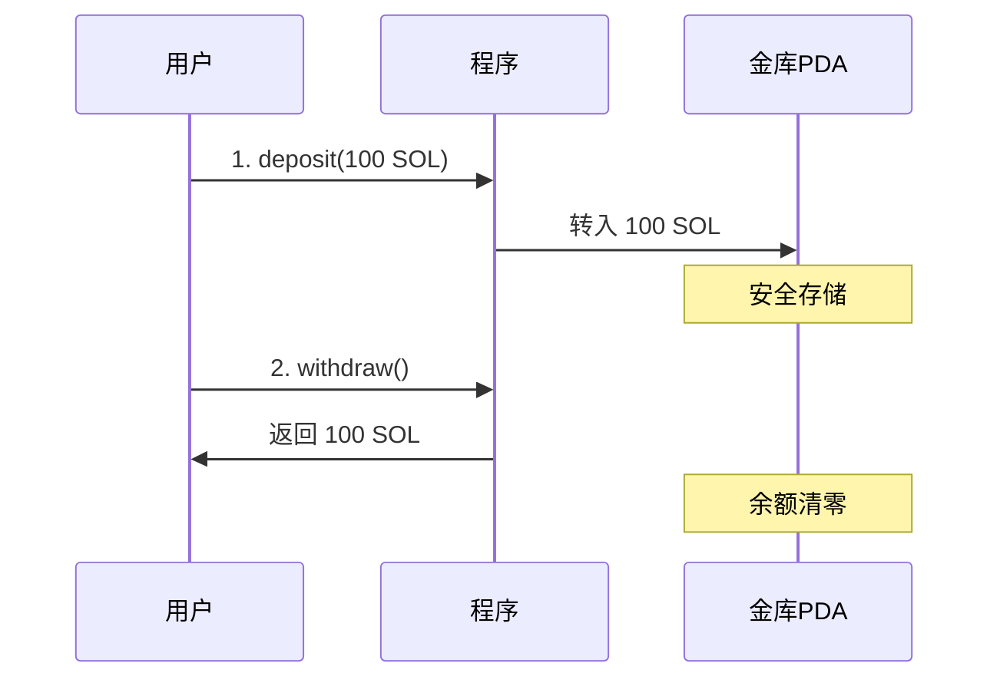

# 🏦 Anchor 金库挑战 - 莫式风格完整教程

嘿，小伙伴！👋 这是一份**手把手教你完成 Anchor 金库挑战**的教程！

**比喻说明**：金库就像银行的保险箱，你存钱进去，只有你能取出来！

---

## 📋 挑战概览

| 项目 | 内容 |
|------|------|
| **挑战名称** | Anchor 金库 |
| **难度** | ⭐⭐（入门） |
| **预计时间** | 30分钟 |
| **目标** | 完成 2/2 测试 |

### 🎯 两个挑战

```
挑战1: 存款 (Deposit)
└── 允许用户将 SOL 存入他们自己的保险库

挑战2: 取款 (Withdraw)  
└── 允许保险库所有者从保险库中提取 SOL
```

---

## 🧠 核心概念

### 什么是 PDA？

**PDA = Program Derived Address**（程序派生地址）

```
普通钱包：有私钥，人控制
PDA账户：无私钥，程序控制 ← 我们用这个做金库！
```

**比喻**：PDA就像银行帮你开的保险箱，只有银行（程序）能打开，但里面的钱是你的！

### 金库工作流程



---

## 🔧 Step 1: 项目结构

### 创建目录

```
anchor-vault/
├── Anchor.toml              # Anchor 配置
├── Cargo.toml               # 工作空间
└── programs/
    └── blueshift_anchor_vault/
        ├── Cargo.toml       # 程序依赖
        └── src/
            └── lib.rs       # ⭐ 核心代码
```

### Cargo.toml (程序)

```toml
[package]
name = "blueshift-anchor-vault"
version = "0.1.0"
edition = "2021"

[lib]
crate-type = ["cdylib", "lib"]
name = "blueshift_anchor_vault"

[dependencies]
anchor-lang = "0.32.1"
```

### Anchor.toml

```toml
[toolchain]
channel = "1.79.0"
anchor_version = "0.32.1"

[programs.localnet]
blueshift_anchor_vault = "22222222222222222222222222222222222222222222"

[provider]
cluster = "Localnet"
wallet = "~/.config/solana/id.json"
```

> ⚠️ **重要**：Program ID 必须是 `22222222222222222222222222222222222222222222`！

---

## 🔧 Step 2: 编写核心代码

### 完整的 lib.rs

```rust
use anchor_lang::prelude::*;
use anchor_lang::system_program::{transfer, Transfer};

// ⚠️ 必须使用这个 Program ID！
declare_id!("22222222222222222222222222222222222222222222");

#[program]
pub mod blueshift_anchor_vault {
    use super::*;

    /// 存款指令
    pub fn deposit(ctx: Context<VaultAction>, amount: u64) -> Result<()> {
        // 检查金库是否为空
        require_eq!(
            ctx.accounts.vault.lamports(),
            0,
            VaultError::VaultAlreadyExists
        );

        // 确保金额超过租金豁免最低值
        require_gt!(
            amount,
            Rent::get()?.minimum_balance(0),
            VaultError::InvalidAmount
        );

        // CPI 转账：用户 → 金库
        transfer(
            CpiContext::new(
                ctx.accounts.system_program.to_account_info(),
                Transfer {
                    from: ctx.accounts.signer.to_account_info(),
                    to: ctx.accounts.vault.to_account_info(),
                },
            ),
            amount,
        )?;

        Ok(())
    }

    /// 取款指令
    pub fn withdraw(ctx: Context<VaultAction>) -> Result<()> {
        // 检查金库有余额
        require_neq!(
            ctx.accounts.vault.lamports(),
            0,
            VaultError::InvalidAmount
        );

        // PDA 签名种子
        let signer_key = ctx.accounts.signer.key();
        let signer_seeds = &[b"vault", signer_key.as_ref(), &[ctx.bumps.vault]];

        // CPI 转账：金库 → 用户（PDA签名）
        transfer(
            CpiContext::new_with_signer(
                ctx.accounts.system_program.to_account_info(),
                Transfer {
                    from: ctx.accounts.vault.to_account_info(),
                    to: ctx.accounts.signer.to_account_info(),
                },
                &[&signer_seeds[..]]
            ),
            ctx.accounts.vault.lamports()
        )?;

        Ok(())
    }
}

/// 账户结构
#[derive(Accounts)]
pub struct VaultAction<'info> {
    #[account(mut)]
    pub signer: Signer<'info>,

    #[account(
        mut,
        seeds = [b"vault", signer.key().as_ref()],
        bump,
    )]
    pub vault: SystemAccount<'info>,

    pub system_program: Program<'info, System>,
}

/// 错误类型
#[error_code]
pub enum VaultError {
    #[msg("Vault already exists")]
    VaultAlreadyExists,
    #[msg("Invalid amount")]
    InvalidAmount,
}
```

---

## 🔧 Step 3: 代码详解

### 3.1 存款核心逻辑

```rust
// 1️⃣ 检查金库是否为空（防止重复存款）
require_eq!(ctx.accounts.vault.lamports(), 0, VaultError::VaultAlreadyExists);
```

**为什么？** 每个用户只能有一个金库！

```rust
// 2️⃣ 检查金额是否足够（大于租金豁免最低值）
require_gt!(amount, Rent::get()?.minimum_balance(0), VaultError::InvalidAmount);
```

**为什么？** Solana 账户需要支付"租金"才能保持激活！

```rust
// 3️⃣ 执行转账（用户 → 金库）
transfer(CpiContext::new(...), amount)?;
```

---

### 3.2 取款核心逻辑

```rust
// 1️⃣ PDA 签名种子
let signer_seeds = &[b"vault", signer_key.as_ref(), &[ctx.bumps.vault]];
```

**关键点**：种子顺序必须和 `seeds = [...]` 定义一致！

```rust
// 2️⃣ PDA 签名转账
transfer(
    CpiContext::new_with_signer(..., &[&signer_seeds[..]]),
    ctx.accounts.vault.lamports()  // 取出全部
)?;
```

**比喻**：程序用"密码"（种子）代表金库签名，授权所有人取款！

---

### 3.3 账户约束解析

```rust
#[account(
    mut,                              // 可变（要修改余额）
    seeds = [b"vault", signer.key().as_ref()],  // PDA种子
    bump,                             // 自动计算bump
)]
pub vault: SystemAccount<'info>,
```

| 约束 | 作用 |
|------|------|
| `mut` | 允许修改账户 |
| `seeds` | 定义 PDA 派生规则 |
| `bump` | 自动使用有效的 bump 值 |

---

## 🔧 Step 4: 构建程序

### WSL 中执行

```bash
# 进入项目目录
cd /mnt/h/你的项目路径/anchor-vault

# 构建 SBF 程序
/home/你的用户名/.local/share/solana/install/active_release/bin/cargo-build-sbf \
  --sbf-out-dir ./target/deploy
```

### PowerShell 一键命令

```powershell
wsl -d Ubuntu-24.04 -- bash -lc "cd /mnt/h/项目路径 && cargo-build-sbf"
```

---

## 🔧 Step 5: 提交测试

### 找到 .so 文件

```
target/deploy/blueshift_anchor_vault.so
```

### 提交到 Blueshift

1. 访问 https://learn.blueshift.gg/zh-CN/challenges/anchor-vault/verify
2. 点击上传区域
3. 选择 `.so` 文件
4. 等待测试结果

### 期望结果

```
✅ 挑战1：接受存款 - 通过
✅ 挑战2：允许提取 - 通过

恭喜！2/2 测试通过！🎉
```

---

## ⚠️ 常见错误排查

### 错误1：0/2 测试失败

**可能原因**：
- Program ID 不是 `222...222`
- signer_seeds 格式错误

**解决**：
```rust
// ✅ 正确的 signer_seeds 格式
let signer_seeds = &[b"vault", signer_key.as_ref(), &[ctx.bumps.vault]];
transfer(..., &[&signer_seeds[..]]);
```

### 错误2：编译失败

**可能原因**：Rust 版本不兼容

**解决**：使用 Solana 自带的 cargo-build-sbf

---

## 📚 知识总结

| 概念 | 说明 |
|------|------|
| PDA | 程序派生地址，无私钥，程序控制 |
| CPI | 跨程序调用，调用系统程序转账 |
| seeds | PDA派生种子，决定地址唯一性 |
| bump | 使地址落在曲线外的偏移值 |

---

## ✅ 完成检查清单

- [ ] Program ID 设置为 `222...222`
- [ ] deposit 检查金库为空
- [ ] deposit 检查金额大于租金最低值
- [ ] withdraw 使用 PDA 签名
- [ ] signer_seeds 格式正确
- [ ] 成功编译 .so 文件
- [ ] 提交后 2/2 测试通过

---

**制作人**：bruceCao  
**微信**：zgrbruce123  
**Twitter**：[@sycbruce](https://twitter.com/sycbruce)  
**最后更新**：2026年1月22日
