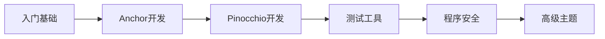

# 📚 课程目录 | Courses

本目录包含所有 Solana 开发课程内容。

## 学习路径

## 课程列表

| # | 课程名称 | 章节数 | 难度 |
|---|----------|--------|------|
| 01 | [区块链与Solana入门](./01-blockchain-and-solana) | 5 | ⭐ |
| 02 | [Solana代币](./02-tokens-on-solana) | 5 | ⭐ |
| 03 | [Solana NFT](./03-nfts-on-solana) | 4 | ⭐ |
| 04 | [Anchor开发教程](./04-anchor-for-dummies) | 8 | ⭐⭐ |
| 05 | [Anchor SPL代币](./05-spl-token-with-anchor) | 9 | ⭐⭐ |
| 06 | [Pinocchio开发教程](./06-pinocchio-for-dummies) | 8 | ⭐⭐ |
| 07 | [Mollusk测试](./07-testing-with-mollusk) | 3 | ⭐⭐ |
| 08 | [Litesvm测试](./08-testing-with-litesvm) | 4 | ⭐⭐ |
| 09 | [Surfpool测试](./09-testing-with-surfpool) | 3 | ⭐⭐ |
| 10 | [程序安全](./10-program-security) | 11 | ⭐⭐⭐ |
| 11 | [Token2022程序](./11-token-2022-program) | 3 | ⭐⭐ |
| 12 | [Web3.js Token2022](./12-token-2022-with-web3js) | 13 | ⭐⭐ |
| 13 | [Anchor Token2022](./13-token-2022-with-anchor) | 13 | ⭐⭐⭐ |
| 14 | [Web3.js SPL代币](./14-spl-token-with-web3js) | 9 | ⭐⭐ |
| 15 | [Secp256r1签名](./15-secp256r1-on-solana) | 4 | ⭐⭐⭐ |
| 16 | [Winternitz签名](./16-winternitz-signatures) | 4 | ⭐⭐⭐ |
| 17 | [Assembly汇编入门](./17-introduction-to-assembly) | 6 | ⭐⭐⭐ |
| 18 | [指令内省](./18-instruction-introspection) | 4 | ⭐⭐⭐ |
| 19 | [Codama SDK](./19-create-sdk-with-codama) | 5 | ⭐⭐⭐ |
| 20 | [Solana支付](./20-solana-pay) | 4 | ⭐⭐ |

---

[⬅️ 返回主页](../README.md)
